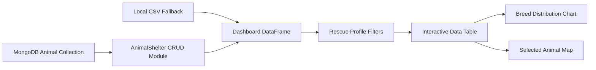
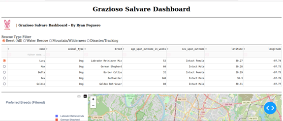
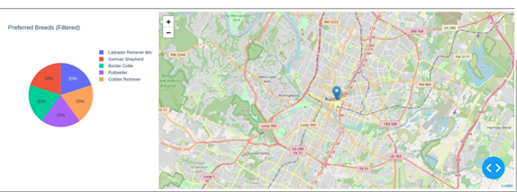
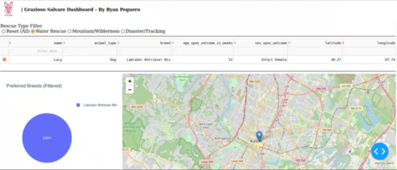
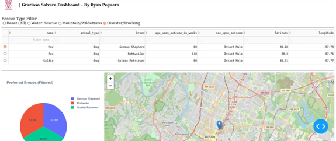

<div align="center">

# Animal Rescue Analytics Dashboard

### Python and MongoDB data access with an interactive rescue-candidate dashboard


[Features](#key-features) · [Architecture](#application-architecture) · [Screenshots](#screenshots) · [Documentation](#project-documentation) · [Run](#installation-and-setup)

</div>

---

## Overview

This project combines a reusable **Python CRUD module** with an interactive **animal-rescue analytics dashboard**. It was developed for the fictional client Grazioso Salvare to help identify shelter animals that match different search-and-rescue training profiles.

The application separates database operations from dashboard behavior, allowing the interface to focus on filtering, visualization and user interaction while the `AnimalShelter` class manages MongoDB access.

| Area | Implementation |
|---|---|
| **Data access** | Python CRUD class using PyMongo |
| **Database** | MongoDB animal collection |
| **Interface** | Jupyter Dash dashboard |
| **Data processing** | Pandas DataFrames |
| **Visualization** | Plotly pie chart and Dash Leaflet map |
| **Resilience** | Local CSV fallback when the classroom database is unavailable |

## Key Features

### Reusable CRUD module

[`animal_shelter.py`](./Grazioso%20Salvare%20Dashboard%20Files/animal_shelter.py) encapsulates the database connection and provides methods for:

- creating animal records
- reading records with MongoDB queries
- updating matching records
- deleting matching records
- handling database exceptions with predictable return values

### Interactive rescue dashboard

[`ProjectTwoDashboard.ipynb`](./Grazioso%20Salvare%20Dashboard%20Files/ProjectTwoDashboard.ipynb) provides:

- water-rescue, mountain/wilderness and disaster/tracking filters
- sortable and filterable shelter-record table
- paginated record browsing
- breed-distribution visualization
- selected-animal geolocation map
- synchronized updates through Dash callbacks
- sample CSV fallback when MongoDB cannot be reached

## Application Architecture



The CRUD layer and dashboard remain separate so database logic can be maintained or reused without rewriting the interface.

## CRUD Operations

| Operation | Method | Behavior |
|---|---|---|
| Create | `create(data)` | Inserts one animal document |
| Read | `read(query)` | Returns matching documents as a list |
| Update | `update(query, new_data)` | Updates matching documents and returns the modified count |
| Delete | `delete(query)` | Deletes matching documents and returns the deleted count |

## Rescue Profiles

The dashboard applies client-defined breed, sex and age criteria for:

| Profile | Intended Use |
|---|---|
| Water Rescue | Identifies animals suited for water-rescue training |
| Mountain/Wilderness | Identifies candidates for rugged outdoor rescue work |
| Disaster/Tracking | Identifies candidates for tracking and disaster-response work |
| Reset | Restores the complete available dataset |

## Screenshots

### Dashboard overview



### Filtered records



### Breed visualization



### Animal location map



## Project Documentation

The complete documentation explains the architecture, CRUD contract, dashboard behavior, data flow, setup, limitations and recommended improvements.

<p align="center">
  <a href="./docs/Animal-Rescue-Dashboard-Documentation.md"><strong>View Project Documentation</strong></a>
  &nbsp;•&nbsp;
  <a href="./docs/Animal-Rescue-Dashboard-Documentation.md?raw=1"><strong>Download Documentation</strong></a>
  &nbsp;•&nbsp;
  <a href="./Grazioso%20Salvare%20Dashboard%20Files/ProjectTwoDashboard.ipynb?raw=1"><strong>Download Jupyter Notebook</strong></a>
</p>

## Installation and Setup

### 1. Clone the repository

```bash
git clone https://github.com/rypeguero/CRUD-Module-With-Python-And-MongoDB.git
cd CRUD-Module-With-Python-And-MongoDB
```

### 2. Create a virtual environment

```bash
python -m venv .venv
```

Activate it on Windows:

```powershell
.venv\Scripts\activate
```

Activate it on macOS or Linux:

```bash
source .venv/bin/activate
```

### 3. Install dependencies

```bash
python -m pip install -r requirements.txt
```

### 4. Launch the dashboard

```bash
jupyter notebook "Grazioso Salvare Dashboard Files/ProjectTwoDashboard.ipynb"
```

## MongoDB Configuration

The original coursework files contain connection values tied to a classroom-hosted MongoDB environment. That server may no longer be available outside the original environment.

For continued development, replace those values with a MongoDB instance you control. Real credentials should be loaded from environment variables or another local configuration source and should not be committed to the repository.

The dashboard includes a small local fallback dataset so the interface can still be demonstrated when the original database cannot be reached.

## Repository Structure

```text
CRUD-Module-With-Python-And-MongoDB/
├── Grazioso Salvare Dashboard Files/
│   ├── animal_shelter.py
│   └── ProjectTwoDashboard.ipynb
├── assets/
│   ├── Picture1.png
│   ├── Picture2.png
│   ├── Picture3.png
│   └── Picture5.png
├── docs/
│   └── Animal-Rescue-Dashboard-Documentation.md
├── requirements.txt
└── README.md
```

## Concepts Demonstrated

`Python` · `MongoDB` · `PyMongo` · `CRUD Operations` · `Dash` · `Jupyter` · `Pandas` · `Plotly` · `Dash Leaflet` · `Callbacks` · `Data Filtering` · `Data Visualization` · `Error Handling` · `Separation of Concerns`

## Portfolio Context

This project demonstrates how a reusable database-access component can support an interactive analytical interface. It also shows how filtering, tabular data, visualization and geolocation can remain synchronized through event-driven callbacks.

---

<div align="center">

**Ryan A. Peguero · Computer Science · Software Engineering**

</div>
