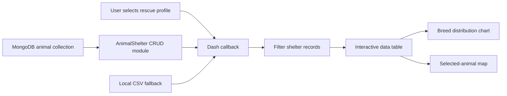

# Animal Rescue Analytics Dashboard: Project Documentation

## Portfolio Summary

This project combines a reusable Python CRUD layer with an interactive analytics dashboard for animal-shelter data. The application was designed for the fictional rescue organization Grazioso Salvare to help identify animals that match search-and-rescue training profiles.

The solution demonstrates how a user interface, application logic and database-access layer can work together while remaining separated into focused components.

## System Components

| Component | File | Responsibility |
|---|---|---|
| MongoDB CRUD module | `Grazioso Salvare Dashboard Files/animal_shelter.py` | Connects to MongoDB and performs create, read, update and delete operations |
| Interactive dashboard | `Grazioso Salvare Dashboard Files/ProjectTwoDashboard.ipynb` | Displays shelter records, rescue filters, charts and map information |
| Screenshot assets | `assets/` | Shows the dashboard interface and visual outputs |
| Dependency list | `requirements.txt` | Lists the Python packages needed to run the project |

## Architecture



## CRUD Module

The `AnimalShelter` class encapsulates database access so the dashboard does not need to contain raw MongoDB operations.

| Method | Input | Result |
|---|---|---|
| `create(data)` | Dictionary containing a new animal record | Inserts one document and returns whether MongoDB acknowledged it |
| `read(query)` | MongoDB query dictionary | Returns matching documents as a list |
| `update(query, new_data)` | Match criteria and replacement field values | Updates matching documents and returns the modified count |
| `delete(query)` | Match criteria | Deletes matching documents and returns the deleted count |

Database exceptions are caught with `PyMongoError`, allowing each operation to return a predictable result instead of crashing the application unexpectedly.

## Dashboard Features

### Rescue-profile filtering

The dashboard provides broad selection profiles for:

- water rescue
- mountain or wilderness rescue
- disaster or tracking work
- reset or display all records

Each profile filters the available records using breed, sex and age criteria associated with the selected rescue category.

### Interactive table

The shelter records are displayed in a Dash data table that supports:

- pagination
- native filtering
- multi-column sorting
- single-row selection
- horizontal scrolling for larger datasets

### Breed visualization

A Plotly pie chart summarizes the breed distribution of the records currently visible after filtering.

### Geolocation view

Selecting a row updates a Dash Leaflet map. The map centers on the animal's stored latitude and longitude and displays the animal name and breed through the marker interface.

### Offline fallback

When the original classroom MongoDB environment is unavailable, the notebook can generate and load a small CSV dataset. This keeps the dashboard demonstrable without requiring access to the original hosted database.

## Data Flow

1. The notebook initializes the `AnimalShelter` database-access class.
2. Records are requested from the MongoDB animal collection.
3. When the database cannot be reached, a local sample dataset is loaded instead.
4. The selected rescue profile filters the working DataFrame.
5. The filtered records update the data table.
6. The chart uses the table's current virtual data.
7. The selected table row updates the map location.

## Installation

From the repository root:

```bash
python -m venv .venv
```

Activate the environment.

### Windows

```powershell
.venv\Scripts\activate
```

### macOS or Linux

```bash
source .venv/bin/activate
```

Install the dependencies:

```bash
python -m pip install -r requirements.txt
```

Launch Jupyter:

```bash
jupyter notebook "Grazioso Salvare Dashboard Files/ProjectTwoDashboard.ipynb"
```

## MongoDB Configuration

The original coursework files contain connection values for a classroom-hosted MongoDB environment. That environment may no longer be available.

For continued development, replace those values with a MongoDB instance you control. Real credentials should be loaded from environment variables or a local configuration file that is excluded from version control.

A production-oriented connection pattern would separate:

- MongoDB URI
- database name
- collection name
- authentication settings

from the source code.

## Known Limitations

- The original hosted database may be unreachable outside the classroom environment.
- The dashboard is stored as a Jupyter notebook rather than a standalone deployable application.
- The CRUD module does not enforce a formal document schema.
- Automated tests are not currently included.
- The sample CSV represents only a small demonstration dataset.
- Connection settings should be moved out of source code before production use.

## Recommended Improvements

1. Move database configuration into environment variables.
2. Convert the notebook into a standalone Dash application.
3. Add schema validation with typed models.
4. Add automated tests for CRUD behavior and dashboard filters.
5. Add structured logging instead of console-only error messages.
6. Add Docker support for reproducible local deployment.
7. Use MongoDB Atlas or a local container for portable database access.
8. Add continuous integration for linting and tests.

## Concepts Demonstrated

`Python` · `MongoDB` · `PyMongo` · `CRUD Operations` · `Dash` · `Jupyter` · `Pandas` · `Plotly` · `Dash Leaflet` · `Data Filtering` · `Callbacks` · `Data Visualization` · `Separation of Concerns` · `Error Handling`

## Portfolio Value

This project demonstrates more than basic database operations. It shows how a reusable data-access component can support an interactive analytical interface, how user selections can drive multiple synchronized visualizations, and how software can remain demonstrable when an external dependency becomes unavailable.
